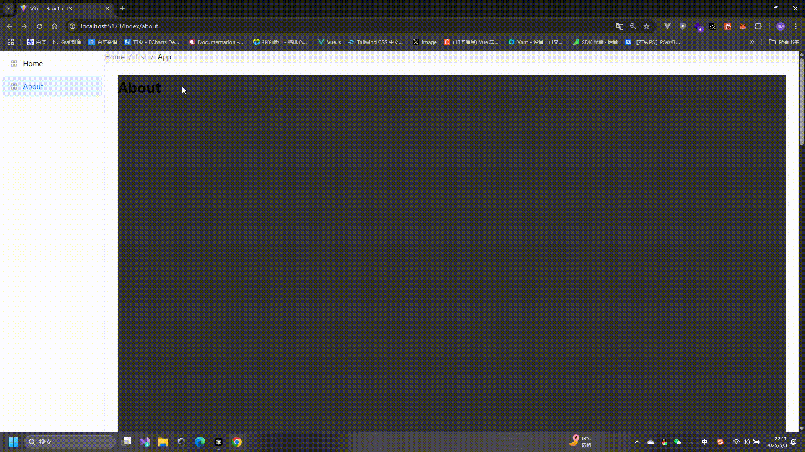
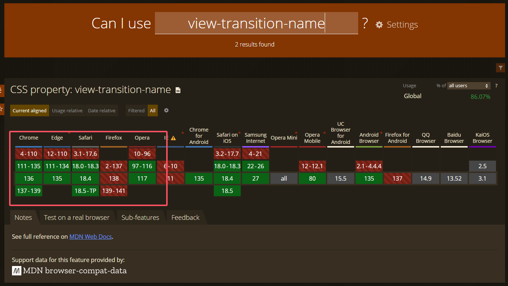

# NavLink

`NavLink` 的使用方式和`Link`组件类似，但是`NavLink`组件可以实现路由的激活状态。

## 使用

```tsx
import { NavLink } from "react-router";

export default function App() {
  return (
    <NavLink to="/about">About</NavLink>
  )
}
```

## 参数(和Link组件的参数类似)

- `to`：要导航到的路径
- `replace`：是否替换当前路径
- `state`：要传递给目标页面的状态
- `relative`：相对于当前路径的导航方式
- `reloadDocument`：是否重新加载页面
- `preventScrollReset`：是否阻止滚动位置重置
- `viewTransition`：是否启用视图过渡


### to

`to` 属性是一个字符串，表示要导航到的路径。

```tsx
<NavLink to="/about">About</NavLink>
```

### replace

`replace` 属性是一个布尔值，表示是否替换当前路径，如果为`true`，则导航不会在浏览器历史记录中创建新的条目，而是替换当前条目。

```tsx
<NavLink replace to="/about">About</NavLink>
```

### state

`state` 属性是一个对象，可以把参数传递给目标页面。

```tsx
<NavLink state={{ from: "home" }} to="/about">About</NavLink>

// 在目标页面获取状态
import { useLocation } from "react-router";

export default function App() {
  const location = useLocation();
  console.log(location.state);
  return <div>Location: {location.state.from}</div>;
}
```

### relative

`relative` 属性是一个字符串，表示相对于当前路径的导航方式，默认的方式是绝对路径，如果想要使用相对路径，可以设置为`path`。

```tsx
//默认是绝对路径
<NavLink relative="route" to="/about">About</NavLink>

//使用相对路径
<NavLink relative="path" to="../about">About</NavLink>

//例如当前的路由是/index/home，那么使用绝对路径导航到/about，会变成/about
<NavLink to="/about">About</NavLink>
//可以使用相对路径导航到/index/about
<NavLink relative="path" to="../about">About</NavLink>
```

### reloadDocument

`reloadDocument` 属性是一个布尔值，表示是否重新加载页面。

```tsx
<NavLink reloadDocument to="/about">About</NavLink>
```

### preventScrollReset

`preventScrollReset` 属性是一个布尔值，表示是否阻止滚动位置重置。

```tsx
<NavLink preventScrollReset to="/about">About</NavLink>
```




### viewTransition

`viewTransition` 属性是一个布尔值，表示是否启用视图过渡，自动增加页面跳转的动画效果。

```tsx
<NavLink viewTransition to="/about">About</NavLink>
```


## 区别

Navlink 会经过以下三个状态的转换，而Link不会，所以Navlink就是一个link的增强版。

- `active`：激活状态(当前路由和to属性匹配)
- `pending`：等待状态(loader有数据需要加载)
- `transitioning`：过渡状态(通过viewTransition属性触发)

### active自动激活

Navlink 会根据当前路由和to属性是否匹配，自动激活。

react-router会为其自动添加样式

```css
a.active {
  color: red;
}

a.pending {
  animate: pulse 1s infinite;
}

a.transitioning {
  /* css transition is running */
}
```

如果不喜欢写样式也可以直接用style属性来设置

```tsx
<NavLink  viewTransition  style={({isActive,isPending,isTransitioning})=>{
    return {
        marginRight:'10px',
        color:isActive?'red':'blue',
        backgroundColor:isPending?'yellow':'transparent', 
    }
}} to="/index/about">About</NavLink>
```

:::warning
1. viewTransition 需要谷歌111版本才能使用，注意兼容性

2. pending只有数据模式，和框架模式才能使用，声明式路由不能使用
:::
