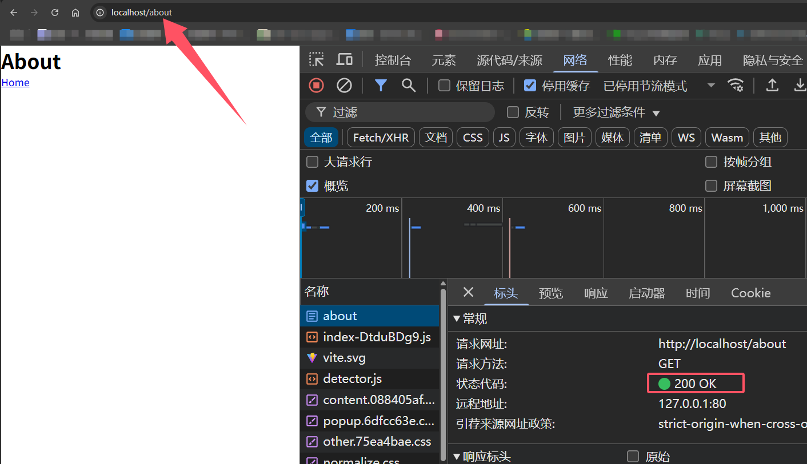

# 路由模式

在React RouterV7 中，是拥有不同的路由模式，路由模式的选择将直接影响你的整个项目。React Router 提供了四种核心路由创建函数：
`createBrowserRouter`、`createHashRouter`、`createMemoryRouter` 和 `createStaticRouter`

### 1. `createBrowserRouter(推荐)`


#### 核心特点：

- 使用HTML5的history API (pushState, replaceState, popState)
- 浏览器URL比较纯净 (/search, /about, /user/123)
- 需要服务器端支持(nginx, apache,等)否则会刷新404

#### 使用场景：

- 大多数现代浏览器环境
- 需要服务器端支持
- 需要URL美观

<hr/>

### 2. `createHashRouter`

#### 核心特点：

- 使用URL的hash部分(#/search, #/about, #/user/123)
- 不需要服务器端支持
- 刷新页面不会丢失

#### 使用场景：

- 静态站点托管例如(github pages, netlify, vercel)
- 不需要服务器端支持

<hr/>

### 3. `createMemoryRouter`

#### 核心特点：

- 使用内存中的路由表
- 刷新页面会丢失状态
- 切换页面路由不显示URL

#### 使用场景：

- 非浏览器环境例如(React Native, Electron)
- 单元测试或者组件测试(Jest, Vitest)

<hr/>

### 4. `createStaticRouter`

#### 核心特点：

- 专为服务端渲染（SSR）设计
- 在服务器端匹配请求路径，生成静态 HTML
- 需与客户端路由器（如 createBrowserRouter）配合使用

#### 使用场景：

- 服务端渲染应用（如 Next.js 的兼容方案）
- 需要SEO优化的页面


## 解决刷新404问题

当使用`createBrowserRouter`时，如果刷新页面会丢失状态，这是因为浏览器默认会去请求服务器上的资源，如果服务器上没有资源，就会返回404。
要解决这个问题就需要在服务器配置一个回退路由，当请求的资源不存在时，返回`index.html`。


- Nginx(推荐)

下载地址：[Nginx](https://nginx.org/en/download.html)

```bash
location / {
  try_files $uri $uri/ /index.html;
}
```



- Apache

```bash
<IfModule mod_negotiation.c>
  Options -MultiViews
</IfModule>

<IfModule mod_rewrite.c>
  RewriteEngine On
  RewriteBase /
  RewriteRule ^index\.html$ - [L]
  RewriteCond %{REQUEST_FILENAME} !-f
  RewriteCond %{REQUEST_FILENAME} !-d
  RewriteRule . /index.html [L]
</IfModule>
```

- Vercel

```json
{
  "rewrites": [{ "source": "/:path*", "destination": "/index.html" }]
}
```

- Nodejs

```js
const http = require('http')
const fs = require('fs')
const httpPort = 80

http
  .createServer((req, res) => {
    fs.readFile('index.html', 'utf-8', (err, content) => {
      if (err) {
        console.log('We cannot open "index.html" file.')
      }

      res.writeHead(200, {
        'Content-Type': 'text/html; charset=utf-8',
      })

      res.end(content)
    })
  })
  .listen(httpPort, () => {
    console.log('Server listening on: http://localhost:%s', httpPort)
  })
```


