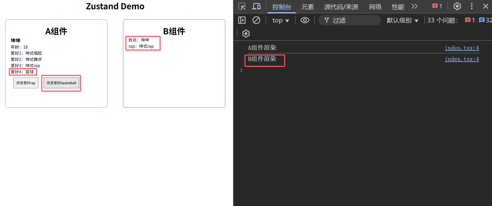

# 状态简化

回忆一下我们在使用`zustand`时，是这样引入状态的(如下),通过解构的方式引入状态，但是这样引入会引发一个问题，例如A组件用到了 `hobby.basketball` 状态，而B组件 没有用到 `hobby.basketball` 状态，但是更新`hobby.basketball`这个状态的时候，A组件和B组件都会重新渲染，这样就导致了不必要的重渲染，因为B组件并没有用到`hobby.basketball`这个状态。

```tsx
const { name, age, hobby, setHobbyRap, setHobbyBasketball } = useUserStore()
return (
    <div className="left">
        <h1>A组件</h1>
        <div>
            <h3>{name}</h3>
            <div>年龄：<span>{age}</span></div>
            <div>爱好1：<span>{hobby.sing}</span></div>
            <div>爱好2：<span>{hobby.dance}</span></div>
            <div>爱好3：<span>{hobby.rap}</span></div>
            <div>爱好4：<span>{hobby.basketball}</span></div>
            <button onClick={() => setHobbyRap('只因你太美')}>改变爱好rap</button>
            <button onClick={() => setHobbyBasketball('篮球')}>改变爱好basketball</button>
        </div>
    </div>
)
```



## 状态选择器

所以为了规避这个问题，我们可以使用状态选择器，状态选择器可以让我们只选择我们需要的部分状态，这样就不会引发不必要的重渲染。

```tsx
const name = useUserStore((state) => state.name)
const age = useUserStore((state) => state.age)
const rap = useUserStore((state) => state.hobby.rap)
const basketball = useUserStore((state) => state.hobby.basketball)
```


## useShallow

你以为这样就结束了? 并没有，你可以想一下如果一个属性很多，例如100个，那我们写起来岂不是要疯了，但是你用解构的话他又会造成不必要的重渲染，真是生与死轮回不止，这时候我们就可以使用`useShallow`来避免这个问题。

:::tip
 `useShallow` 只检查顶层对象的引用是否变化，如果顶层对象的引用没有变化（即使其内部属性或子对象发生了变化，但这些变化不影响顶层对象的引用），使用 useShallow 的组件将不会重新渲染
:::

```tsx
import { useShallow } from 'zustand/react/shallow';
const { rap, name } = useUserStore(useShallow((state) => ({
    rap: state.hobby.rap,
    name: state.name
})))
```


## 代码获取

store/user.ts

```ts
import { create } from 'zustand'
import { immer } from 'zustand/middleware/immer'
interface User {
    name: string,
    age: number,
    hobby: {
        sing: string,
        dance: string,
        rap: string,
        basketball: string,
    }
    setHobbyRap: (rap: string) => void,
    setHobbyBasketball: (basketball: string) => void
}
const useUserStore = create<User>()(immer((set) => ({
    name: '坤坤',
    age: 18,
    hobby: {
        sing: '坤式唱腔',
        dance: '坤式舞步',
        rap: '坤式rap',
        basketball: '坤式篮球'
    },
    setHobbyRap: (rap: string) =>set((state) => {
        state.hobby.rap = rap
    }),
    setHobbyBasketball: (basketball: string) => set((state) => {
        state.hobby.basketball = basketball
    })
})))

export default useUserStore;
```

A component

```tsx
import '../index.css'
import useUserStore from '../../store/user';
export default function Left() {
    console.log('A组件渲染')
    const { name, age, hobby, setHobbyRap, setHobbyBasketball } = useUserStore()
    return (
        <div className="left">
            <h1>A组件</h1>
            <div>
                <h3>{name}</h3>
                <div>年龄：<span>{age}</span></div>
                <div>爱好1：<span>{hobby.sing}</span></div>
                <div>爱好2：<span>{hobby.dance}</span></div>
                <div>爱好3：<span>{hobby.rap}</span></div>
                <div>爱好4：<span>{hobby.basketball}</span></div>
                <button onClick={() => setHobbyRap('只因你太美')}>改变爱好rap</button>
                <button onClick={() => setHobbyBasketball('篮球')}>改变爱好basketball</button>
            </div>
        </div>
    )
}

```

B component

```tsx
import '../index.css'
import useUserStore from '../../store/user';
import { useShallow } from 'zustand/react/shallow';
export default function Right() {
    console.log('B组件渲染')
    const { rap, name } = useUserStore(useShallow((state) => ({
        rap: state.hobby.rap,
        name: state.name
    })))
    return (
        <div className="right">
            <h1>B组件</h1>
            <div>
                <div>姓名：<span>{name}</span></div>
                <div>rap：<span>{rap}</span></div>
            </div>
        </div>
    )
}
```

css

```css
.left {
    width: 50%;
    height: 100%;
    border: 1px solid rgb(19, 204, 148);
    height: 300px;
    margin:30px;
    padding: 20px;
    border-radius: 10px;
}


.right {
    width: 50%;
    height: 100%;
    border: 1px solid rgb(214, 35, 35);
    height: 300px;
    margin:30px;
    padding: 20px;
    border-radius: 10px;
}


.left button {
    margin: 10px;
    padding: 10px;
}

.right button {
    margin: 10px;
    padding: 10px;
}

```