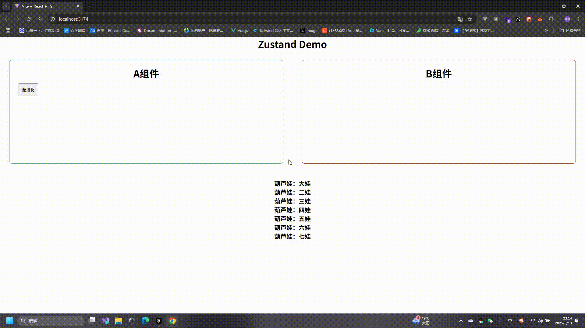

# 状态处理

## 目录
- [深层次状态处理](#深层次状态处理)
- [使用 immer 中间件](#使用-immer-中间件)
- [immer 原理剖析](#immer-原理剖析)

## 深层次状态处理

在上一章我们讲了，Zustand 会合并第一层的 state，但是对于深层次的状态更新，我们需要特别注意。让我们通过一个葫芦娃的例子来演示。

### 基础实现

```ts
import { create } from 'zustand'

interface User {
    gourd: {
        oneChild: string,
        twoChild: string,
        threeChild: string,
        fourChild: string,
        fiveChild: string,
        sixChild: string,
        sevenChild: string,
    },
    updateGourd: () => void
}

// 创建 store
const useUserStore = create<User>(((set) => ({
    // 初始化葫芦娃状态
    gourd: {
        oneChild: '大娃',
        twoChild: '二娃',
        threeChild: '三娃',
        fourChild: '四娃',
        fiveChild: '五娃',
        sixChild: '六娃',
        sevenChild: '七娃',
    },
    // 更新方法
    updateGourd: () => set((state) => ({
        gourd: {
            // ...state.gourd,  // 需要手动合并状态
            oneChild: '大娃-超进化',
        }
    }))
})))

export default useUserStore;
```

> 注意：如果不进行状态合并，其他状态会丢失。每次更新都需要手动合并状态，这在实际开发中会变得很繁琐。



## 使用 immer 中间件

### 安装
```bash
npm install immer
```

### 基础用法
```ts
import { produce } from 'immer'

const data = {
  user: {
    name: '张三',
    age: 18
  }
}

// 使用 produce 创建新状态
const newData = produce(data, draft => {
  draft.user.age = 20  // 直接修改 draft
})

console.log(newData, data) 
// 输出:
// { user: { name: '张三', age: 20 } } 
// { user: { name: '张三', age: 18 } }
```

### 在 Zustand 中使用
```ts
import { create } from 'zustand'
import { immer } from 'zustand/middleware/immer'

// 注意：使用 immer 中间件时的特殊结构
const useUserStore = create<User>()(immer(((set) => ({
    gourd: {
        oneChild: '大娃',
        twoChild: '二娃',
        threeChild: '三娃',
        fourChild: '四娃',
        fiveChild: '五娃',
        sixChild: '六娃',
        sevenChild: '七娃',
    },
    updateGourd: () => set((state) => {
        // 直接修改状态，无需手动合并
        state.gourd.oneChild = '大娃-超进化'
        state.gourd.twoChild = '二娃-谁来了'
        state.gourd.threeChild = '三娃-我来了'
    })
}))))
```

## immer 原理剖析

immer.js 通过 Proxy 代理对象的所有操作，实现不可变数据的更新。当对数据进行修改时，immer 会创建一个被修改对象的副本，并在副本上进行修改，最后返回修改后的新对象，而原始对象保持不变。这种机制确保了数据的不可变性，同时提供了直观的修改方式。

immer 的核心原理基于以下两个概念：

1. 写时复制 (Copy-on-Write)
   - 无修改时：直接返回原对象
   - 有修改时：创建新对象

2. 惰性代理 (Lazy Proxy)
   - 按需创建代理
   - 通过 Proxy 拦截操作
   - 延迟代理创建

### 工作流程
```mermaid
graph TD
A[调用 produce] --> B[创建代理 draft]
B --> C[执行 recipe 修改 draft]
C --> D{是否有修改？}
D -- 是 --> E[创建新对象：...base + ...modified]
D -- 否 --> F[直接返回 base]
```

### 简化实现
```ts
type Draft<T> = {
  -readonly [P in keyof T]: T[P];
};

function produce<T>(base: T, recipe: (draft: Draft<T>) => void): T {
  // 用于存储修改过的对象
  const modified: Record<string, any> = {};
  
  const handler = {
    get(target: any, prop: string) {
      // 如果这个对象已经被修改过，返回修改后的对象
      if (prop in modified) {
        return modified[prop];
      }
      
      // 如果访问的是对象，则递归创建代理
      if (typeof target[prop] === 'object' && target[prop] !== null) {
        return new Proxy(target[prop], handler);
      }
      return target[prop];
    },
    set(target: any, prop: string, value: any) {
      // 记录修改
      modified[prop] = value;
      return true;
    }
  };

  // 创建代理对象
  const proxy = new Proxy(base, handler);
  
  // 执行修改函数
  recipe(proxy);
  
  // 如果没有修改，直接返回原对象
  if (Object.keys(modified).length === 0) {
    return base;
  }
  
  // 创建新对象，只复制修改过的属性
  return JSON.parse(JSON.stringify(proxy))
}

// 使用示例
const state = {
  user: {
    name: '张三',
    age: 25
  }
};

const newState = produce(state, draft => {
  draft.user.name = '李四';
  draft.user.age = 26;
});

console.log(state);     // { user: { name: '张三', age: 25 } }
console.log(newState);  // { user: { name: '李四', age: 26 } }
```

:::tip
注意：这是一个简化实现，没有考虑数组的情况和深层次的代理，只实现了其核心思想。
:::
